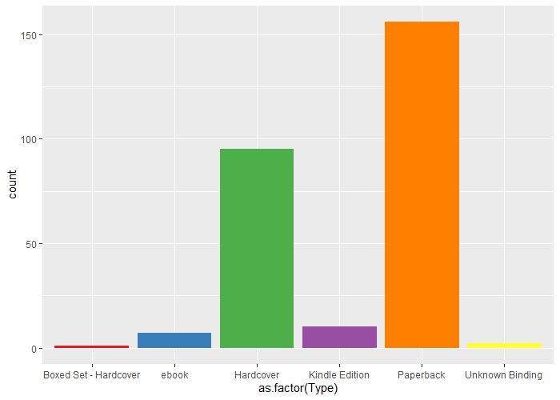

# R-Assignment 4

**Created by Hirun Kongpetch (ID: 63130500127)**

Choose Dataset:
1. Top 270 Computer Science / Programing Books (Data from Thomas Konstantin, [Kaggle](https://www.kaggle.com/thomaskonstantin/top-270-rated-computer-science-programing-books)) >> [Using CSV](https://raw.githubusercontent.com/safesit23/INT214-Statistics/main/datasets/prog_book.csv)

### Outlines
1. Explore the dataset
2. Learning function from Tidyverse
3. Transform data with dplyr and finding insight the data
4. Visualization with GGplot2

## Part 1: Import and Explore the dataset

```R
#Library
library(dplyr , readr , ggplot2)

csv_books <- read.csv("https://raw.githubusercontent.com/safesit23/INT214-Statistics/main/datasets/prog_book.csv")
#Explore
is.character(csv_books$Reviews)
csv_books$Reviews <- csv_books$Reviews %>% str_remove(',') %>% as.numeric()
glimpse(csv_books)
```

### Result

```{R}
Rows: 271
Columns: 7
$ Rating          <dbl> 4.17, 4.01, 3.33, 3.97, 4.06, 3.84, 4.09, 4.15, 3.87, 4.62, 4.03, 3.78, 3.73, 3.87, 3.87,~
$ Reviews         <dbl> 3829, 1406, 0, 1658, 1325, 117, 5938, 1817, 2093, 0, 160, 481, 33, 1255, 593, 417, 80, 27~
$ Book_title      <chr> "The Elements of Style", "The Information: A History, a Theory, a Flood", "Responsive Web~
$ Description     <chr> "This style manual offers practical advice on improving writing skills. Throughout, the e~
$ Number_Of_Pages <int> 105, 527, 50, 393, 305, 288, 256, 368, 259, 128, 352, 352, 200, 328, 240, 288, 392, 304, ~
$ Type            <chr> "Hardcover", "Hardcover", "Kindle Edition", "Hardcover", "Kindle Edition", "Paperback", "~
$ Price           <dbl> 9.323529, 11.000000, 11.267647, 12.873529, 13.164706, 14.188235, 14.232353, 14.364706, 14~
```

จากการสำรวจข้อมูลได้ผลสรุปว่า มีจำนวนแถวทั้งหมด 271 แถว มีคอลัมน์ทั้งหมด 7 คอลัมน์ โดยแบ่งองค์ประกอบต่างๆ ได้ดังนี้

|      Name       | Datatype|
|-----------------|---------|
|1. Rating          |double   |
|2. Reviews         |character|
|3. Book_title      |character|
|4. Description     |character|
|5. Number_Of_Pages |integer  |
|6. Type            |character|
|7. Price           |double   |

## Part 2: Learning function from Tidyverse
- Function `geom_line()` from package [ggplot2](https://ggplot2.tidyverse.org/reference/geom_path.html?q=geom%20_%20line)). The result is displayed as a line graph.

## Part 3: Transform data with dplyr and finding insight the data

### 1). จำนวนหน้าของหนังสือที่เยอะที่สุดของแต่ะประเภท
```{R}
csv_books %>%  select(Type, Number_Of_Pages) %>% 
  group_by(Type) %>% 
  summarise(max_Page = max(Number_Of_Pages)) %>%
  arrange(desc(max_Page))
```
### Result
```{R}
# A tibble: 6 x 2
  Type                  max_Page
  <chr>                    <int>
1 Hardcover                 3168
2 Paperback                 1214
3 Boxed Set - Hardcover      896
4 ebook                      787
5 Kindle Edition             422
6 Unknown Binding            288
> 
```
### 2). ชื่อหนังสือที่ราคาแพงที่สุด 10
```{R}
csv_books %>% select(Book_title, Price) %>%
  arrange(desc(Price)) %>% head(n = 10)
```
### Result
```{R}
Book_title                                                                               Price                      
1                                             A Discipline for Software Engineering    235.6500
2                            The Art of Computer Programming, Volumes 1-3 Boxed Set    220.3853
3                           The Art of Computer Programming, Volumes 1-4a Boxed Set    220.3853
4                                               An Introduction to Database Systems    212.0971
5   3D Game Engine Architecture: Engineering Real-Time Applications with Wild Magic    203.1088
6                                Numerical Recipes: The Art of Scientific Computing    176.1441
7                                                           Game Programming Gems 3    143.1382
8                                                           Game Programming Gems 4    139.4353
9                                      Compilers: Principles, Techniques, and Tools    126.5794
10                                                          Game Programming Gems 6    119.2029
> 
```

### 3). จำนวนรีวิวทั้งหมดของหนังสือแต่ละประเภท
```{R}
csv_books %>% select(Type, Reviews) %>%
  group_by(Type) %>% summarise(amount = sum(Reviews)) %>%
  arrange(desc(amount))
```
### Result
```{R}
# A tibble: 6 x 2
  Type                  amount
  <chr>                  <dbl>
1 Hardcover              29942
2 Paperback              18136
3 Kindle Edition          1565
4 ebook                    360
5 Unknown Binding          247
6 Boxed Set - Hardcover     36
> 
```

### 4). 10 อันดับชื่อหนังสือที่ rating น้อยที่สุด
```{R}
  csv_books %>% select(Book_title, Rating) %>%
    arrange(Rating) %>% head(n = 10)
```
### Result
```{R}
  Book_title                                                                      Rating
1                         Advanced Game Programming: A Gamedev.Net Collection      3.00
2                          Cross-Platform Game Programming (Game Development)      3.00
3                     Lambda-Calculus, Combinators and Functional Programming      3.00
4                                               Game Programming Golden Rules      3.20
5                                                            Beginning Java 2      3.22
6                                  Sams Teach Yourself JavaScript in 24 Hours      3.32
7                                Responsive Web Design Overview For Beginners      3.33
8                                              Unity Virtual Reality Projects      3.37
9                                        Sams Teach Yourself Perl in 24 Hours      3.38
10 3D Game Engine Design: A Practical Approach to Real-Time Computer Graphics      3.45
```

### 5). ราคาเฉลี่ยของหนังสือแต่ละประเภท
```{R}
  csv_books %>% select(Type, Price) %>%
    group_by(Type) %>% summarise(avg_price = mean(Price))
```
### Result
```{R}
  # A tibble: 6 x 2
  Type                  avg_price
  <chr>                     <dbl>
1 Boxed Set - Hardcover     220. 
2 ebook                      51.4
3 Hardcover                  70.1
4 Kindle Edition             32.4
5 Paperback                  45.8
6 Unknown Binding            37.2
> 
```

### 6). #ค่าเฉลี่ยของจำนวนหน้าหนังสือที่มีราคามากกว่า 100 ดอล
```{R}
  csv_books %>% filter(Price > 100) %>% summarise(mean_Page = mean(Number_Of_Pages))
  csv_books %>% summarise(mean(Number_Of_Pages))
```
### Result
```{R}
  mean_Page
1  967.8095 
```
## Part 4: Visualization with GGplot2

### 1). กราฟเส้นแสดงความสัมภัณธ์ระหว่าง ratings และ price
```{R}
line <- csv_books %>% ggplot(aes(x = Price, y=Number_Of_Pages)) 
        + geom_line(aes(color = Type))
line + geom_smooth()
```
### Result 


### 2). กราฟแท่งแสดงจำนวนทั้งหมดของ type 
```{R}
bars <- csv_books %>% ggplot(aes(x = as.factor(Type), fill = as.factor(Type))) 
        + geom_bar() +
        scale_fill_brewer(palette = "Set1") +
        theme(legend.position="none")
bars
```

### Result

