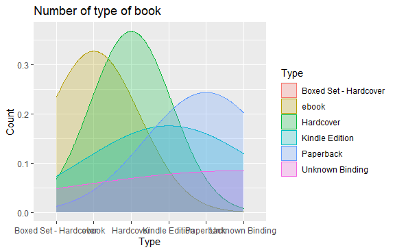
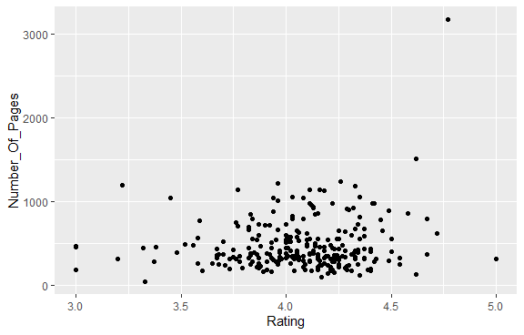

# R-Assignment 4

**Created by Wongsakorn Saengsurasak (ID: 63130500102)**
  
  Choose Dataset:
  1. Top 270 Computer Science / Programing Books (Data from Thomas Konstantin, [Kaggle](https://www.kaggle.com/thomaskonstantin/top-270-rated-computer-science-programing-books)) >> [Using CSV](https://raw.githubusercontent.com/safesit23/INT214-Statistics/main/datasets/prog_book.csv)

### Outlines
1. Explore the dataset
2. Learning function from Tidyverse
3. Transform data with dplyr and finding insight the data
4. Visualization with GGplot2

## Part 1: Import and Explore the dataset

```R
# Library
install.packages("dplyr")
install.packages("readr")
install.packages("ggplot2")
install.packages("stringr")
install.packages("tidyr")

library(dplyr)
library(readr)
library(ggplot2)
library(stringr)
library(tidyr)

# Load data
prog_book <- read.csv('https://raw.githubusercontent.com/safesit23/INT214-Statistics/main/datasets/prog_book.csv')

# Explore data
glimpse(prog_book)
View(prog_book)
```

### Result

```{R}
Rows: 271
Columns: 7
$ Rating          <dbl> 4.17, 4.01, 3.33, 3.97, 4.06, 3.84, 4.09, 4.15, 3.87, 4.62, 4.03, 3.78, 3.…
$ Reviews         <chr> "3,829", "1,406", "0", "1,658", "1,325", "117", "5,938", "1,817", "2,093",…
$ Book_title      <chr> "The Elements of Style", "The Information: A History, a Theory, a Flood", …
$ Description     <chr> "This style manual offers practical advice on improving writing skills. Th…
$ Number_Of_Pages <int> 105, 527, 50, 393, 305, 288, 256, 368, 259, 128, 352, 352, 200, 328, 240, …
$ Type            <chr> "Hardcover", "Hardcover", "Kindle Edition", "Hardcover", "Kindle Edition",…
$ Price           <dbl> 9.323529, 11.000000, 11.267647, 12.873529, 13.164706, 14.188235, 14.232353…
```

จากการสำรวจข้อมูลได้ผลสรุปว่า มีจำนวนแถวทั้งหมด 271 แถว และมีคอลัมน์ทั้งหมด 7 คอลัมน์ โดยแบ่งได้ดังนี้
|      Name       | Datatype|
|-----------------|---------|
|1. Rating          |double   |
|2. Reviews         |character|
|3. Book_title      |character|
|4. Description     |character|
|5. Number_Of_Pages |integer  |
|6. Type            |character|
|7. Price           |double   |


## Part 2: Learning function from Tidyverse

Function select , filter , arrange from package [dplyr](https://dplyr.tidyverse.org/articles/dplyr.html#select-columns-with-select).
- `select()` - use for select column(s) of data from a dataframe to display or operate
- `filter()` - use for filter a group of data by using condition(s) check
- `arrange()` - use to arrange the data ascending or descending


### Example of dplyr function:

```{R}
prog_book %>% select(Book_title,Rating) %>% 
  filter(Rating>4.50) %>% 
  arrange(desc(Rating))
```
### Result:

```{R}
                                                                                                 Book_title Rating
1                                                                                   Your First App: Node.js   5.00
2                                                   The Art of Computer Programming, Volumes 1-4a Boxed Set   4.77
3  Designing Data-Intensive Applications: The Big Ideas Behind Reliable, Scalable, and Maintainable Systems   4.72
4               Build Web Applications with Java: Learn every aspect to build web applications from scratch   4.67
5                                                  Fluent Python: Clear, Concise, and Effective Programming   4.67
6                                           ZX Spectrum Games Code Club: Twenty fun games to code and learn   4.62
7                             The Linux Programming Interface: A Linux and Unix System Programming Handbook   4.62
8                                                                          CLR via C# (Developer Reference)   4.58
9                       The Elements of Computing Systems: Building a Modern Computer from First Principles   4.54
10                                                                 Practical Object Oriented Design in Ruby   4.54
```
## Part 3: Transform data with dplyr and finding insight the data
### 1). หนังสือที่มีราคาถูกที่สุด
```{R}
prog_book %>% select(Book_title,Rating,Price) %>% 
  filter(Price == min(Price))
```
### Result
```{R}
             Book_title Rating    Price
1 The Elements of Style   4.17 9.323529
```
### 2). หนังสือประเภท ebook มีทั้งหมดกี่เล่ม
```{R}
prog_book %>% select(Book_title,Type) %>% 
  filter(Type == "ebook")
```
### Result
```{R}
                                       Book_title  Type
1                         Your First App: Node.js ebook
2                             Algorithms Unlocked ebook
3             Learn You a Haskell for Great Good! ebook
4         From Mathematics to Generic Programming ebook
5   Effective Programming: More Than Writing Code ebook
6                                   Deep Learning ebook
7 Practical Foundations for Programming Languages ebook
```
### 3). เรตติ้งเฉลี่ยของหนังสือแต่ละประเภท
```{R}
prog_book %>% group_by(Type) %>% summarise(avg=mean(Rating))
```
### Result
```{R}
  Type                    avg
  <chr>                 <dbl>
1 Boxed Set - Hardcover  4.49
2 ebook                  4.29
3 Hardcover              4.06
4 Kindle Edition         4.01
5 Paperback              4.06
6 Unknown Binding        3.99
```
### 4). หนังสือที่ไม่มีการรีวิวและจำนวนหน้าหนังสือต่ำกว่า 200
```{R}
prog_book %>% select(Book_title,Reviews,Number_Of_Pages) %>% 
  filter(Reviews == 0,Number_Of_Pages < 200)
```
### Result
```{R}
                                                                     Book_title Reviews Number_Of_Pages
1                                  Responsive Web Design Overview For Beginners       0              50
2               ZX Spectrum Games Code Club: Twenty fun games to code and learn       0             128
3 Python Programming For Beginners: Quick And Easy Guide For Python Programmers       0             190
4                       Lambda-Calculus, Combinators and Functional Programming       0             192
```
### 5). หนังสือที่มีเรตติ้งน้อยที่สุด 5 อันดับ
```{R}
prog_book %>% select(Book_title, Rating) %>% 
  arrange(Rating) %>% head(n = 5)
```
### Result
```{R}
                                                                                 Book_title Rating
1                                       Advanced Game Programming: A Gamedev.Net Collection   3.00
2 Cross-Platform Game Programming (Game Development) (Charles River Media Game Development)   3.00
3                                   Lambda-Calculus, Combinators and Functional Programming   3.00
4                                                             Game Programming Golden Rules   3.20
5                                                                          Beginning Java 2   3.22
```
### 6). แสดงรายละเอียดของหนังสือที่มีคำว่า "Data"
```{R}
str_subset(prog_book$Book_title,"Data")
```
### Result
```{R}
 [1] "Weapons of Math Destruction: How Big Data Increases Inequality and Threatens Democracy"                  
 [2] "Big Data: A Revolution That Will Transform How We Live, Work, and Think"                                 
 [3] "Data and Goliath: The Hidden Battles to Collect Your Data and Control Your World"                        
 [4] "Practical SQL: A Beginner's Guide to Storytelling with Data"                                             
 [5] "Doing Data Science"                                                                                      
 [6] "Big Data: Principles and best practices of scalable realtime data systems"                               
 [7] "Managing Data Using Excel"                                                                               
 [8] "Designing Data-Intensive Applications: The Big Ideas Behind Reliable, Scalable, and Maintainable Systems"
 [9] "Python for Data Analysis"                                                                                
[10] "Data Science from Scratch: First Principles with Python"                                                 
[11] "Data Structures and Algorithms"                                                                          
[12] "Mining of Massive Datasets"                                                                              
[13] "Database System Concepts"                                                                                
[14] "An Introduction to Database Systems"  
```
## Part 4: Visualization with GGplot2
### 1). Graph แสดงจำนวนประเภทหนังสือ
### Code:
```{R}
ggplot(prog_book) + 
  aes(x = Type, color = Type, fill = Type) + 
  geom_density(alpha = 0.25) + 
  ggtitle("Number of type of book") + 
  xlab("Type")+ylab("Count")
```
### Result:


### 2). Scatter Plot แสดงความสัมพันธ์ระหว่างเรตติ้งกับจำนวนหน้า
### Code:
```{R}
prog_book %>% ggplot(aes(x=Rating,y=Number_Of_Pages)) + 
  geom_point()
```
### Result:


